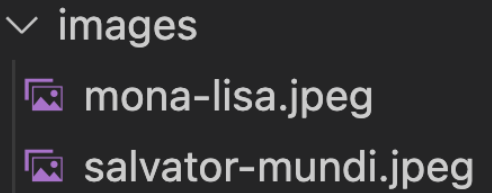

# Challenge 1
In this challenge, you will leverage the HTML cheat sheet.
## Task 1
Using the Spring Initializr, create a new project with the following attributes:
Group Id: com.ltp
Artifact-Id: painting
Dependencies: Spring Web, and Spring Boot Devtools

## Task 2
If you have not downloaded the course resources already, see the Workbooks and Challenges lesson.

## Task 3
Add an index.html file under the static folder.

## Task 4
Inside spring-boot-bootcamp-resources > 1.intro-to-springboot > challenge > starter, there are two paintings of Mona Lisa and Salvator Mundi. Inside the static folder, create an images folder and drag the paintings there.

## Task 5
Using the HTML cheat sheet:
Create a header element that displays: "Da Vinci Artwork".
Create another image element that displays the Mona Lisa.
Create an image element that displays the Salvator Mundi.
Give each painting a width of 200.

## Task 6
Using the HTML cheat sheet, place each painting in a block-level container. In other words, a container that takes up the whole width.

## Task 7
Using the HTML cheat sheet, display the following text under each image:
The Salvator Mundi was painted for King Louis XII of France
The Mona Lisa is a half-length portrait painting by Italian artist Leonardo da Vinci.

## Task 8
Using the HTML cheat sheet, place the text inside an inline element.

### Good Luck!
